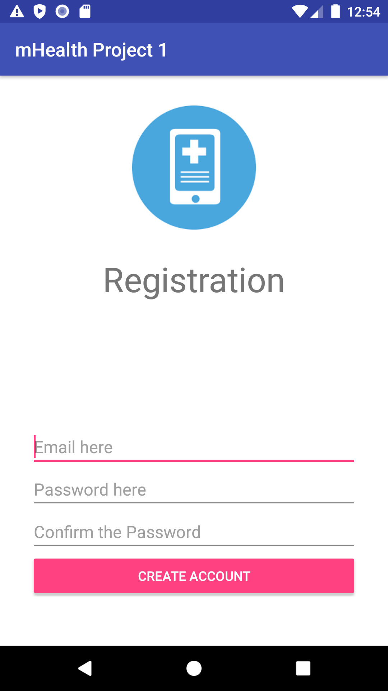
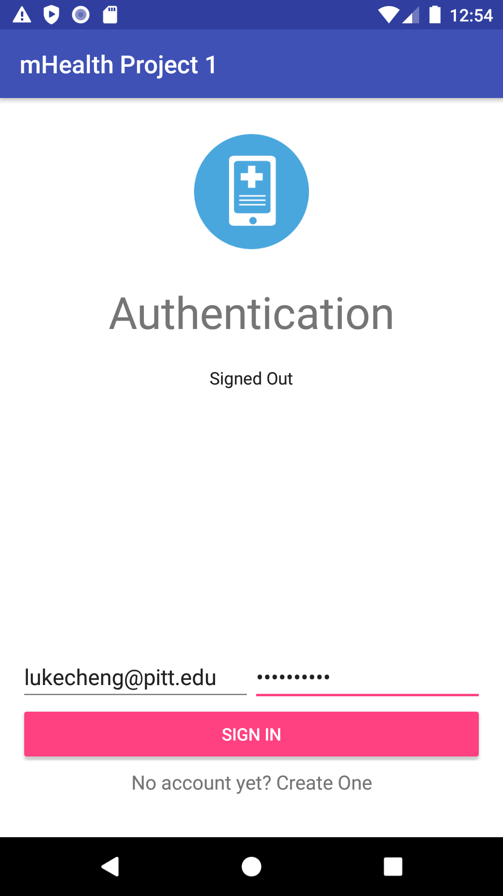
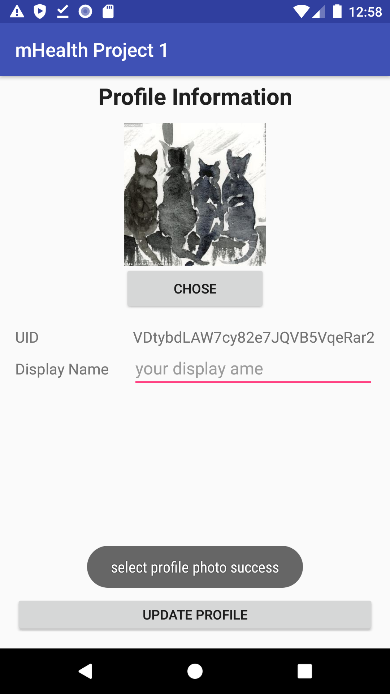
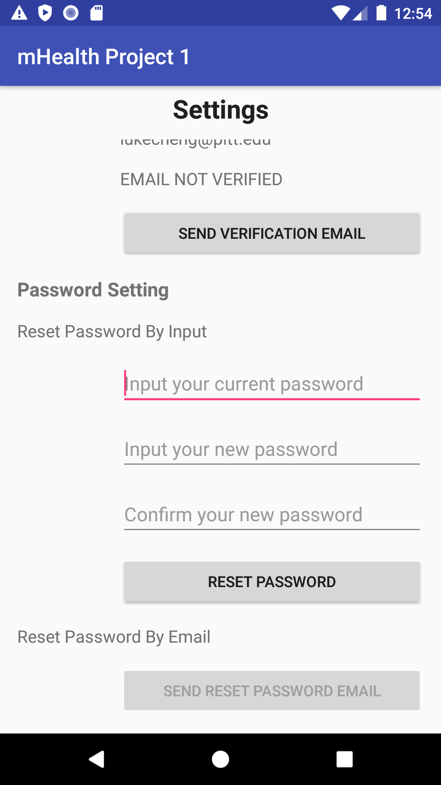
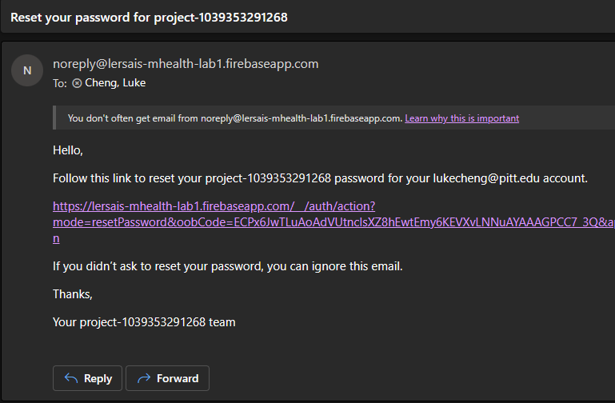

# Project 1

## Tasks

- [x] 1. Build your first app and familiarize with the development environment

- [x] 2.1 Go through and learn the whole skeleton of the project
- [x] 2.2 Implement the registration feature (SignupActivity)

- [x] 2.3 Implement the authentication feature (LoginActivity)

- [x] 2.4 Implement the sign out function (MainActivity).

see source code

- [x] 3.1 Allow user to update display name (ProfileActivity)
- [x] 3.2 Allow user to update profile photo (ProfileActivity)
- [x] 3.3 Display user’s name and photo (ProfileActivity)

- [x] 4.1 reset password by input (SettingActivity)

- [x] 4.2 reset password by sending email (SettingActivity)

- [ ] 5: Demo of Medical Record Management

